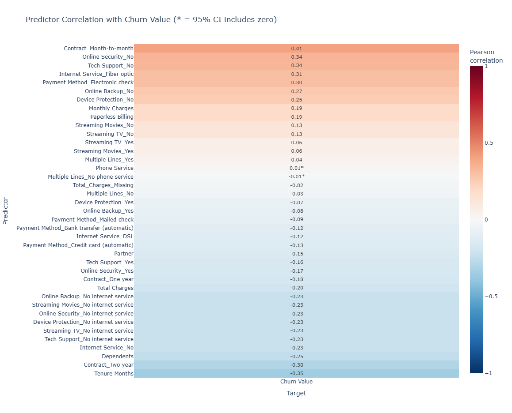
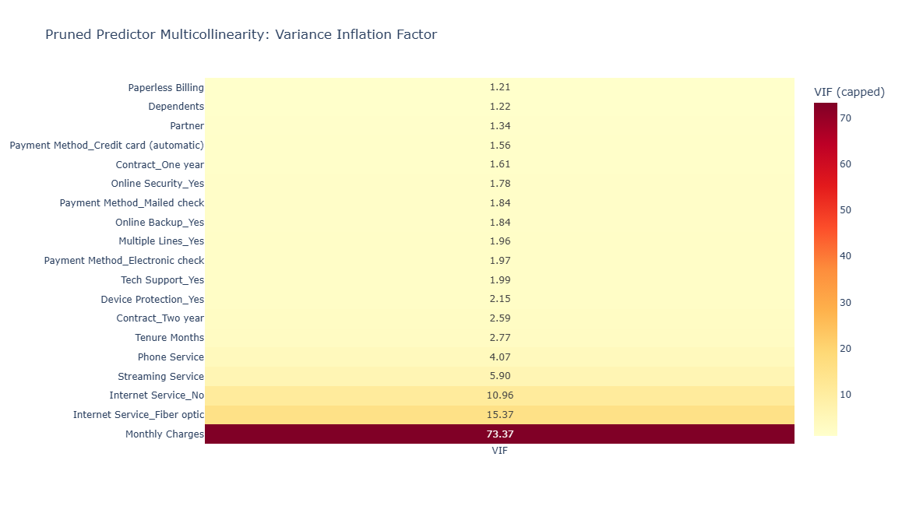
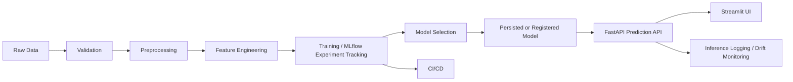
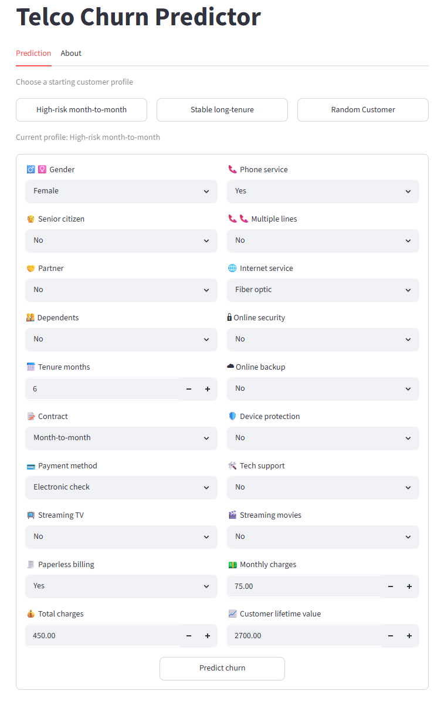

# Telco Customer Churn Prediction & Retention Targeting System


A professional end-to-end machine learning project for predicting customer churn in a fictional telecommunications company. This repository is being built as a complete ML workflow, moving from exploratory analysis and baseline modeling toward deployment, monitoring, and CI/CD-ready MLOps practices.

**Live demo:** [Hugging Face Space](https://huggingface.co/spaces/helsharif/telco-churn-prediction)

## Business Problem

Customer churn reduces recurring revenue and increases acquisition costs. For a subscription-based telecom business, identifying customers who are likely to leave can help retention teams prioritize outreach, understand churn drivers, and design targeted interventions before customers cancel service.

## ML Objective

The primary machine learning task is binary classification: predict whether a customer will churn during the quarter. The preferred modeling target is `Churn Value`, where `1` indicates churn and `0` indicates retention.

## Dataset

The raw dataset is the IBM Telco Customer Churn dataset available on Kaggle:

[Telco Customer Churn IBM Dataset](https://www.kaggle.com/datasets/yeanzc/telco-customer-churn-ibm-dataset)

The dataset contains 7,043 customer records and 33 variables describing demographics, geography, subscribed services, billing information, tenure, churn outcome, and churn-related post-outcome fields. The raw CSV is expected locally at:

```text
data/raw/Telco_customer_churn.csv
```

Raw data files are intentionally excluded from version control.

## Target and Leakage Notes

`Churn Value` is the preferred target column for modeling. `Churn Label` is directly equivalent to the target and should not be used as a feature.

The following fields are treated as non-feature or leakage columns by default:

- `CustomerID`
- `Count`
- `Lat Long`
- `Latitude`
- `Longitude`
- `Churn Label`
- `Churn Value`
- `Churn Score`
- `Churn Reason`
- `Churn Category`, if present
- Other direct churn explanation or post-outcome fields, if introduced later

`Churn Score`, `Churn Reason`, and churn-category fields may contain information generated after or directly because of the churn event. They should only be used in clearly separated leakage analysis or business interpretation sections, not in model training features.

Latitude and longitude fields are also excluded from the default feature set. They may be useful for geographic analysis, but the first modeling pass will avoid raw coordinates to reduce the risk of location memorization and overly local patterns.

## Planned Workflow

1. Exploratory data analysis, cleaning, and feature engineering
2. Interpretable logistic-regression baseline
3. XGBoost classification modeling
4. Logistic-regression vs XGBoost model selection and holdout evaluation
5. Model evaluation and error analysis
6. Model explainability with SHAP
7. FastAPI deployment path
8. Monitoring and data quality checks
9. CI/CD automation

## Repository Structure

```text
Customer-Churn-End-to-End-ML/
├── README.md
├── .gitignore
├── churn_ml_env001.yml
├── churn_ml_wsl_env001.yml
├── requirements.txt
├── pyproject.toml
├── app/                       # Application entry points and serving assets
├── artifacts/                 # Saved models, metrics, and generated outputs
├── config/                    # Project and experiment configuration
├── data/
│   ├── raw/                   # Source data and its original data dictionary
│   ├── interim/               # Optional transient transformation outputs
│   └── processed/             # Model-ready outputs created by Notebook 01
│       ├── prediction_df_logistic_regression.csv
│       ├── prediction_df_logistic_regression_data_dictionary.md
│       ├── prediction_df_xgboost.csv
│       └── prediction_df_xgboost_data_dictionary.md
├── docker/                    # Containerization resources
├── great_expectations/        # Data-quality configuration and expectation suites
├── mlruns/                    # Local MLflow artifact files
├── notebooks/
│   ├── 01_eda_data_cleaning.ipynb
│   ├── 02_baseline_modeling_logistic_regression.ipynb
│   ├── 03_xgboost_modeling.ipynb
│   ├── 04a_tabFM_modeling.ipynb
│   ├── 04b_tabFM_JAX_modeling.ipynb
│   └── 05_model_selection.ipynb
├── scripts/                   # Runnable project automation scripts
├── src/churn_ml/
│   ├── config.py
│   ├── data/
│   ├── features/
│   ├── models/
│   ├── explainability/
│   └── api/
├── tests/
└── .github/workflows/
```

## Modeling Notebook Flow

Run the notebooks in numerical order. Notebook 01 produces the model-ready CSV and its field-level data dictionary. Notebooks 02, 03, and 04 use the same stratified 80/20 holdout split for directly comparable logistic-regression, XGBoost, and TabFM results. Notebook 04 has separate PyTorch and JAX variants; `04a_tabFM_modeling.ipynb` is the GPU-backed TabFM candidate used for comparison, while `04b_tabFM_JAX_modeling.ipynb` is an optional WSL/JAX backend experiment. The JAX notebook defaults to CPU because the JAX/Orbax checkpoint restore exceeded the 8 GB VRAM available on the RTX 4060 Laptop GPU. Notebook 05 uses five-fold stratified cross-validation on the training split to select between the baseline, XGBoost, and PyTorch TabFM candidates by PR AUC, then evaluates the candidates once on the untouched holdout set. Each modeling notebook defaults its prediction threshold to the training-set churn rate; set `CHURN_THRESHOLD` to a value from 0 to 1 to override it.

The selected PyTorch TabFM settings for model selection are `TABFM_N_ESTIMATORS = 8`, `TABFM_BATCH_SIZE = 1`, and `TABFM_MAX_CONTEXT_ROWS = 2048`. This run completed on the local CUDA GPU in about eight minutes for the single holdout evaluation in notebook 04a and produced holdout metrics of accuracy 0.7630, precision 0.5361, recall 0.7941, F1 0.6401, PR AUC 0.6781, and ROC AUC 0.8599. These settings improved the initial faster TabFM trial enough to justify using them in notebook 05, while avoiding further runtime expansion.

Notebook 01 creates two model-ready datasets, each with 7,043 records and `Churn Value` as the final column. The logistic-regression dataset uses the multicollinearity-pruned predictors and excludes `Monthly Charges`. The XGBoost/TabFM dataset retains the complete encoded predictor set because these nonlinear models are not sensitive to linear multicollinearity in the way logistic regression is. Yes/no features are encoded as 0/1, categorical features with 3-5 levels are one-hot encoded, and the full-feature dataset retains `Total_Charges_Missing` to record a blank source `Total Charges` value.

Notebooks 02, 03, 04, and 05 log lightweight experiment evidence to local MLflow tracking in `mlflow.db`, with local artifact files under `mlruns/`: parameters, metrics, comparison tables, and retention-targeting summaries. They do not log the TabFM checkpoint or model weights.

For TabFM, add `HF_TOKEN` to the project-root `.env` file to authenticate Hugging Face downloads. Notebooks 04 and 05 load `.env` before requesting the TabFM checkpoint and only report whether a token is configured.

## Deployment and Monitoring Plan

The repository includes a minimal FastAPI application as the starting point for service deployment. Future phases will add a production-style inference endpoint, serialized model artifacts, input validation, data quality checks with Great Expectations, monitoring metrics, and CI/CD automation for testing and deployment readiness.

## Technologies

- Python 3.12
- pandas, NumPy, SciPy
- scikit-learn
- XGBoost
- TabFM with PyTorch/CUDA, plus optional WSL/JAX experimentation
- Optuna
- SHAP
- Plotly, Matplotlib, Kaleido
- MLflow
- FastAPI, Uvicorn, Pydantic
- Great Expectations
- pytest
- GitHub Actions

## Current Status

The project produces a documented processed dataset and includes historical experiments for logistic-regression baseline modeling, Optuna-tuned XGBoost modeling, TabFM benchmarking, and cross-validated model selection. The packaged MLOps workflow intentionally compares only logistic regression and XGBoost.

## Current Model Selection

The current practical recommendation is to select the Optuna-tuned XGBoost model for the retention-targeting workflow. In the project's historical model-selection experiment, PyTorch/CUDA TabFM had the strongest conventional predictive metrics with mean CV PR AUC 0.6971, holdout PR AUC 0.6781, and holdout ROC AUC 0.8599. XGBoost was very close predictively, with mean CV PR AUC 0.6932, holdout PR AUC 0.6725, and holdout ROC AUC 0.8559, but it produced the highest top-100 campaign expected net value: **$24,647.51** for XGBoost versus **$23,555.11** for logistic regression and **$16,017.86** for TabFM.

This is not a contradiction. TabFM, logistic regression, and XGBoost can all rank customers by churn risk, and TabFM ranked customers well on conventional metrics. The campaign objective adds another layer: customers are ranked by expected campaign value, which combines each model's churn probability with retained-LTV value and campaign costs. A model can have slightly better overall PR AUC while assigning probability scores that move different customers above or below the top-100 value cutoff. In this saved run, TabFM's top-100 campaign list overlapped XGBoost on 75 customers, but the 25 different choices had a lower combined churn-probability-and-value profile under the current outreach-cost, offer-cost, offer-acceptance, and retention-uplift assumptions. TabFM also took substantially longer to run, especially in five-fold cross-validation, without improving the business objective. The expected-value comparison depends on the assumed retention uplift and offer-acceptance rate; validate those assumptions with a controlled campaign before production deployment.

## Model Trade-Offs in This Project

The packaged workflow compares two practical model families: logistic regression as the interpretable linear baseline and XGBoost as the tuned nonlinear tabular model. Historical project experiments also evaluated TabFM as a foundation-model benchmark, but TabFM is not part of the production-style training, serving, or monitoring workflow.

| Dimension            | Logistic Regression                              | XGBoost                                  | TabFM                                                         |
| -------------------- | ------------------------------------------------ | ---------------------------------------- | ------------------------------------------------------------- |
| Role in this project | Transparent baseline                             | Recommended practical model              | Foundation-model benchmark                                    |
| Architecture         | Linear / parametric                              | Gradient-boosted decision trees          | Transformer-based tabular foundation model                    |
| Training requirement | Required, very fast                              | Required, plus tuning                    | No local weight training, but repeated inference is expensive |
| Feature interactions | Mostly manual                                    | Learned automatically                    | Learned through pretrained attention patterns                 |
| Interpretability     | Strongest; coefficients are directly inspectable | Moderate; use SHAP or feature importance | Weakest; mostly black-box behavior                            |
| Runtime profile      | Fastest                                          | Fast and production-friendly             | Slowest in this project, especially during cross-validation   |
| Best project use     | Auditable benchmark and fallback                 | Retention campaign deployment candidate  | Experimental comparison and cold-start reference              |

Logistic regression remains valuable because it is simple, auditable, and cheap to run. Its main weakness is that it only captures linear relationships unless interactions are manually engineered. In this project, it performed respectably, with holdout PR AUC 0.6393 and expected net value $23,555.11, but it trailed XGBoost on both predictive ranking and campaign value. It is still a good fallback when transparency, governance, or low-resource deployment matter more than incremental performance.

XGBoost is the best fit for the current business objective. It captures nonlinear patterns and interactions in the encoded churn features, runs efficiently, and produced the best top-100 expected net value at $24,647.51. Its main cost is complexity: it required Optuna tuning, and explanations should use post-hoc tools such as SHAP rather than raw coefficients. For this project, that trade-off is worthwhile because XGBoost is nearly tied with TabFM on holdout PR AUC while being faster, simpler to operate, and better aligned with the retention-value calculation.

TabFM is useful as a modern foundation-model benchmark, but it did not become the practical winner here. With the stronger PyTorch/CUDA settings, it produced the best mean CV PR AUC and the best holdout PR AUC, ROC AUC, precision, accuracy, and F1. However, it took much longer to run and produced the lowest campaign expected net value at $16,017.86. TabFM can rank prospects just like logistic regression and XGBoost; the issue is that the final campaign ranking was not based on churn probability alone. It used expected net value, roughly combining predicted churn probability, retained-LTV value, retention-uplift assumptions, and outreach/offer costs. TabFM's probability scores produced a different top-100 value-ranked list. Under the current cost and value assumptions, that list contained fewer high-value save opportunities than the XGBoost list, even though TabFM was slightly stronger on aggregate classification metrics.

Some of TabFM's usual advantages were also not fully exercised in this project. TabFM can be attractive for rapid prototyping, cold-start tables, limited local labels, and tables with meaningful raw text fields. This churn workflow already had labels, a compact structured dataset, and a deliberate feature-engineering pipeline built for fair comparison with logistic regression and XGBoost. Because the project used encoded model-ready features rather than raw text-heavy tables, TabFM's foundation-model strengths had less room to shine.

The practical rule for the packaged workflow is: use logistic regression when interpretability is the deciding factor, and use XGBoost for the current production-style retention workflow.

## Project Visuals

The exploratory visuals below summarize feature relationships that informed the modeling workflow. Positive correlations indicate predictors associated with higher churn in the encoded modeling data, while negative correlations indicate predictors associated with retention.



The multicollinearity review was used to understand redundant predictors and guide the interpretable logistic-regression baseline. XGBoost can retain correlated predictors more comfortably because tree-based models are less sensitive to linear multicollinearity than logistic regression.



### Confusion Matrices

The confusion matrices below are shown as markdown tables for readability. They use the historical 26.5% churn-rate threshold from the model-selection evidence. Rows are actual outcomes and columns are predicted outcomes.

**Logistic Regression**

| Actual outcome | Predicted: No Churn | Predicted: Churn |
|---|---:|---:|
| Churn | 27 | 347 |
| No Churn | 566 | 469 |

**XGBoost**

| Actual outcome | Predicted: No Churn | Predicted: Churn |
|---|---:|---:|
| Churn | 20 | 354 |
| No Churn | 556 | 479 |

**TabFM Benchmark, Historical Reference Only**

TabFM was evaluated as a foundation-model benchmark during project experimentation, but it is not part of the packaged training, serving, or monitoring workflow.

| Actual outcome | Predicted: No Churn | Predicted: Churn |
|---|---:|---:|
| Churn | 77 | 297 |
| No Churn | 778 | 257 |

## Roadmap

- Complete EDA notebook with target distribution and feature summaries
- Validate schema and missing-value assumptions
- Build cleaned modeling dataset
- Train and evaluate baseline logistic regression
- Add model comparison experiments
- Validate the selected model and retention assumptions with a controlled campaign
- Add SHAP explanations and business-facing interpretation
- Package inference pipeline
- Add FastAPI prediction endpoint
- Add Great Expectations validation suite
- Add monitoring and CI/CD improvements

## Setup

Create and activate the conda environment:

```bash
conda env create -f churn_ml_env001.yml
conda activate churn_ml_env001
python -m ipykernel install --user --name churn_ml_env001 --display-name "Python (churn_ml_env001)"
```

For pip-based tooling or CI, install the package with development dependencies:

```bash
python -m pip install --upgrade pip
python -m pip install -e ".[dev]"
```

Run tests:

```bash
pytest
```

Start the FastAPI health check locally:

```bash
uvicorn churn_ml.api.main:app --reload
```

Then open:

```text
http://127.0.0.1:8000/health
```

## Production-Oriented MLOps Extension

This repository keeps the exploratory analysis as reference artifacts and extends the project logic into reusable Python modules under `src/churn_ml/`. The packaged workflow is the reproducible path for validation, preprocessing, training, model selection, serving, UI interaction, and local monitoring.



### Added Package Structure

```text
src/churn_ml/
├── api/                 # FastAPI app, schemas, dependencies
├── data/                # loading, validation, cleaning, preprocessing
├── features/            # reusable feature engineering
├── models/              # training, evaluation, selection, prediction helpers
├── monitoring/          # JSONL inference logging and drift checks
├── pipelines/           # end-to-end training and inference pipelines
├── ui/                  # Streamlit API client
└── utils/               # paths and logging helpers
```

The production-style pipeline preserves key project decisions: `Churn Value` is the binary target, churn-derived fields are excluded, `CustomerID` is not used as a feature, `Total Charges` blank values are handled safely, model selection uses PR AUC, and the default threshold follows the training churn rate before validation-based threshold tuning.

### Training

Activate the existing Conda environment and run the package pipeline from the repository root:

```bash
conda activate churn_ml_env001
python scripts/run_training.py
```

Equivalent module command:

```bash
python -m churn_ml.pipelines.training_pipeline
```

The pipeline loads `data/raw/Telco_customer_churn.csv`, validates the raw schema, engineers leakage-safe features, creates stratified train/validation/test splits, compares logistic regression and XGBoost only, logs MLflow metrics when available, selects the best validation PR AUC model, tunes the threshold on validation data, evaluates once on the test split, and writes:

```text
artifacts/models/production_model.joblib
artifacts/monitoring/training_baseline.parquet
reports/metrics/model_comparison.csv
reports/metrics/final_evaluation.json
reports/figures/
```

### MLflow

Training uses local MLflow tracking with:

```text
sqlite:///mlflow.db
```

Launch the tracking UI:

```bash
make mlflow
```

Then open `http://127.0.0.1:5000`.

### FastAPI

Train once first so `artifacts/models/production_model.joblib` exists, then run:

```bash
uvicorn churn_ml.api.main:app --reload
```

Endpoints:

```text
GET  /health
GET  /model-info
POST /predict
```

Interactive OpenAPI docs are available at `http://127.0.0.1:8000/docs`.

### Streamlit UI

On Windows PowerShell, start FastAPI and Streamlit together with:

```powershell
.\scripts\run_app.ps1
```

This opens FastAPI in a separate PowerShell window, waits for `/health`, then starts Streamlit on `http://localhost:8502` in the current window.



The UI calls the FastAPI endpoint rather than loading the model directly. To run the services manually, start FastAPI first and then run:

```bash
streamlit run src/churn_ml/ui/app.py
```

Configure the API URL with:

```bash
CHURN_API_BASE_URL=http://127.0.0.1:8000
```

### Docker

Build and run the API and UI together:

```bash
docker compose up --build
```

The API is exposed on `http://127.0.0.1:8000` and the UI on `http://127.0.0.1:8502`. Mounts expect a trained model artifact under `artifacts/models/`.

### Hugging Face Spaces Deployment

This project is prepared for Hugging Face Spaces using the Docker SDK. The container trains the production model artifact during image build, starts FastAPI internally on port `8000`, and exposes the Streamlit UI on port `7860`.

Recommended Space settings:

```text
SDK: Docker
App port: 7860
```

Deployment steps:

1. Create a new Hugging Face Space.
2. Select `Docker` as the SDK.
3. Push this repository's files to the Space repository, including `Dockerfile`, `requirements-hf.txt`, `src/`, `scripts/`, `data/raw/`, `config/`, and `artifacts/models/xgboost_optuna_best_params.json`.
4. Let the Space build the Docker image.
5. Open the Space URL after the build completes.

The Hugging Face image uses `requirements-hf.txt` rather than the full research environment so the hosted demo avoids unnecessary TabFM/PyTorch dependencies. The hosted app still preserves the full local architecture by running Streamlit against the FastAPI prediction endpoint inside the same container.

### Testing, Linting, and CI

Run local checks:

```bash
make lint
make test
```

GitHub Actions runs dependency installation, Ruff linting, pytest, import validation, and a Docker image build on pushes and pull requests to `main`.

### Monitoring

FastAPI writes anonymized JSON Lines inference logs to:

```text
logs/inference.jsonl
```

Generate a local drift report against the saved training baseline:

```bash
python -m churn_ml.monitoring.drift_detection
```

This is a local monitoring foundation for demonstration and portfolio use. It is not a claim of real-time production monitoring.

### Helpful Commands

```bash
make install
make test
make lint
make train
make api
make ui
make docker-up
make drift
```

### Known Limitations

- Historical TabFM experimentation remains available as reference context, but TabFM is not part of the packaged training/serving workflow.
- The package pipeline compares only logistic regression and XGBoost.
- MLflow model registry behavior is local and environment-dependent; the pipeline always persists a local production bundle.
- Drift detection compares distributions only; it does not monitor labels, business outcomes, or real campaign lift.
- FastAPI explanations are intentionally minimal until a stable model-explanation artifact is added.

## GPU Notes

The default conda environment installs standard CPU-compatible `xgboost` from conda-forge so the Windows setup is reliable. GPU-enabled XGBoost can be explored later as an optional optimization after the baseline workflow is stable.

If you want to experiment with CUDA XGBoost, first confirm that your NVIDIA driver, CUDA runtime, Python version, and the package wheel all match. Avoid making GPU XGBoost a required environment dependency unless the install path is proven on the target machine.

TabFM uses PyTorch with CUDA support in `churn_ml_env001`. The environment file pins the CUDA 12.8 PyTorch wheel source and `torch==2.11.0+cu128`, which has been verified on the local NVIDIA GeForce RTX 4060 Laptop GPU.

For JAX GPU experiments, use WSL2 and `churn_ml_wsl_env001.yml`. Native Windows JAX is CPU-only, while the WSL environment installs TabFM with JAX/CUDA support and has been verified to see `CudaDevice(id=0)`.
